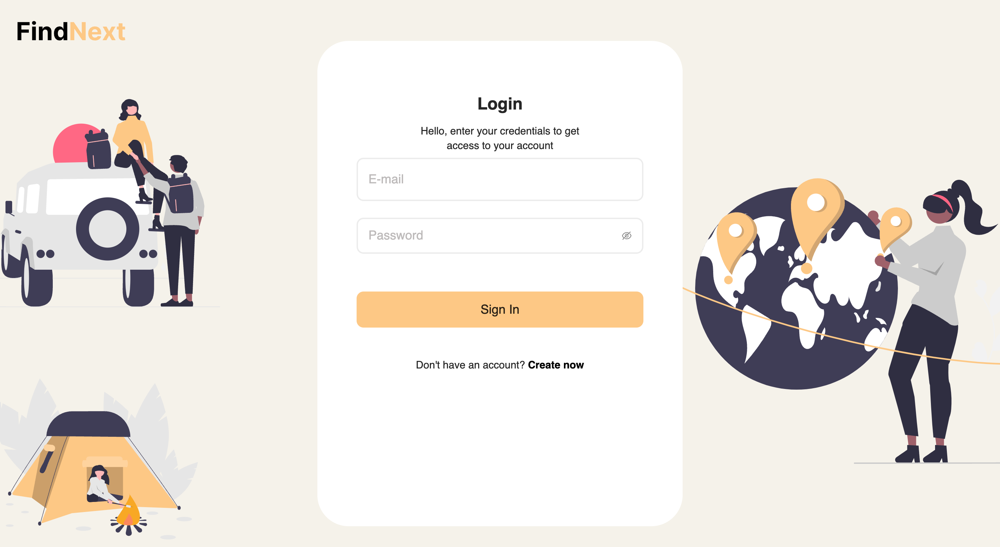
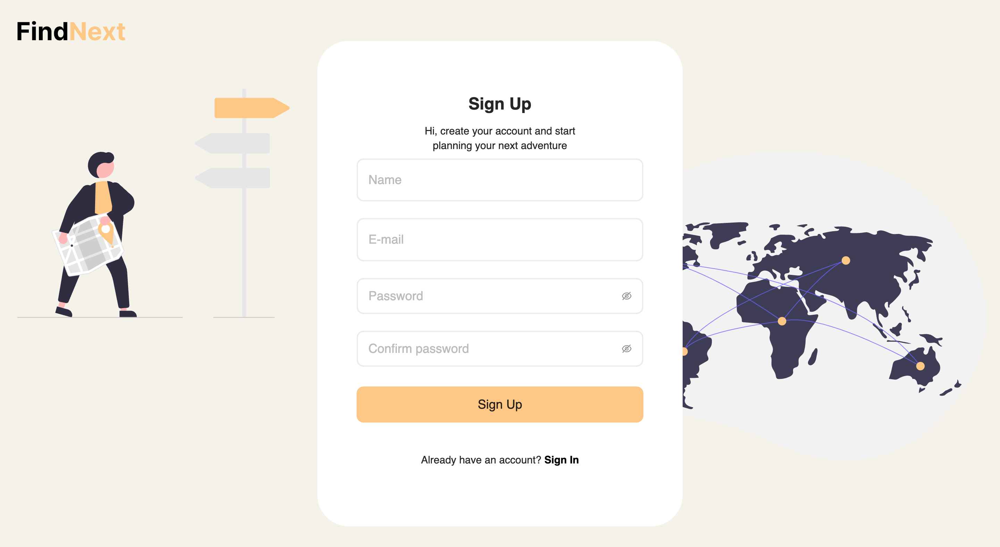
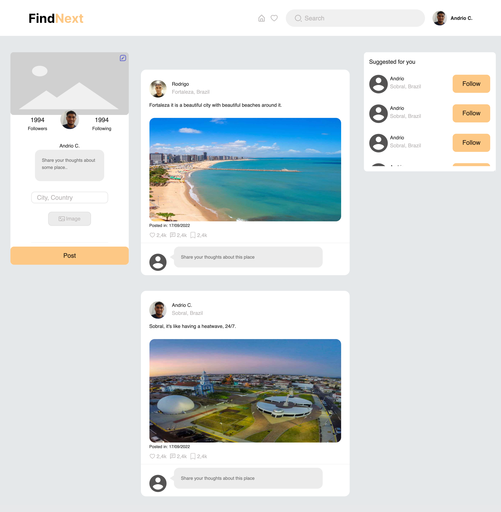

## Description

This is the frontend for the FindNext project. FindNext is a simple social network built to people get to know new places to visit and explore.

<h1>
    
Login page

    
</h1>

<h1>
    
Sign Up page

    
</h1>

<h1>
    
Home page

    
</h1>

## :fire: Technologies

This project was built using the following techs:

- React.
- TypeScript.
- Styled components.
- GraphQL (Apollo Client).
- Netlify (Deploy frontend).

## :desktop_computer: Available Scripts

In the project directory, you can run:

### `yarn`

This way you can install all the dependencies that are required to run this project.

### `yarn start`

Runs the app in the development mode.\
Open [http://localhost:3000](http://localhost:3000) to view it in the browser.

The page will reload if you make edits.\
You will also see any lint errors in the console.
